# Varnish Caching with Dockerized Nginx

This repository contains the configuration files and setup instructions to deploy Varnish as a caching layer in front of an Nginx server. The setup uses Docker Compose to manage containers, including both Varnish and Nginx.


# Request Flow Diagram Explanation

## Overview

This document provides a step-by-step explanation of how an HTTPS request is handled from a user through a CDN server, to a Varnish cache server, then to Dockerized Nginx, and finally to the WordPress server. The diagram below illustrates this flow.

```mermaid
graph LR
    User[User]
    CDNServer[CDN Server nginx + Let's Encrypt]
    VarnishServer[Varnish Cache Server]
    NGINX[Dockerized Nginx http port]
    WordPressServer[WordPress Server https, 443]

    %% Flow from User to CDN
    User -->|HTTPS Request| CDNServer

    %% Flow from CDN to Varnish
    CDNServer -->|HTTP Request| VarnishServer

    subgraph Varnish Cache Flow
        VarnishServer -->|Check Cache| CachedResponse[Cached Response]
        CachedResponse -->|Return to CDN| CDNServer

        VarnishServer -->|Miss in Cache| NginxRequest[Forward Request to Nginx]
        NginxRequest -->|HTTP Request| NGINX
    end

    %% Flow from Nginx to WordPress
    subgraph Nginx Proxy Flow
        NGINX -->|HTTPS Proxy Request| WPRequest[WordPress Server Request]
        WPRequest -->|HTTPS Request| WordPressServer
        WordPressServer -->|Response| ResponseToNginx[Response to Nginx]
        ResponseToNginx -->|HTTP Response| VarnishCacheResponse[Varnish Cache Response]
        VarnishCacheResponse -->|Store in Cache| Varnish_Cache[Update Varnish Cache]
        VarnishCacheResponse -->|Return to CDN| CDNServer
    end

    %% Flow from CDN back to User
    CDNServer -->|HTTPS Response| User
```



## Detailed Explanation

1. **User**:
   - The user initiates an HTTPS request to access your website.

2. **CDN Server (nginx + Let's Encrypt)**:
   - The request is forwarded through a Content Delivery Network (CDN) server equipped with nginx and Let's Encrypt for SSL termination.
   - The CDN receives the HTTPS request from the user and forwards it to the Varnish Cache Server over HTTP.

3. **Varnish Cache Server**:
   - **Check Cache**: Varnish checks if the requested content is already cached.
     - If the content is in the cache, it returns the cached response directly to the CDN server.
     - If the content is not cached, Varnish forwards the request to Dockerized Nginx using an HTTP request.

4. **Dockerized Nginx**:
   - **Proxy Pass**: The Dockerized Nginx acts as a reverse proxy and forwards the request to the WordPress server over HTTPS (port 443).
   - The Nginx server uses SSL termination for the connection with the WordPress server, ensuring secure communication.

5. **WordPress Server**:
   - **Response**: The WordPress server processes the request and returns the response back to Dockerized Nginx via an HTTPS connection.
   - The WordPress server can be running either nginx or Apache with SSL configured on port 443.

6. **Varnish Cache Response**:
   - **Store in Cache**: Varnish caches the new content received from the WordPress server.
   - Varnish updates its cache and forwards the response back to the CDN server over HTTP.

7. **CDN Server (nginx + Let's Encrypt)**:
   - The CDN server receives the response from Varnish and forwards it back to the user over HTTPS, ensuring secure communication with the user.

## Conclusion

This setup ensures efficient caching and secure communication between the components. The CDN handles SSL termination, Varnish caches content for performance optimization, and Dockerized Nginx serves as a reverse proxy to securely communicate with the WordPress server. This architecture is robust and scalable, providing an optimal experience for users.
## Prerequisites

- Ubuntu Server (or any Linux distribution)
- Basic understanding of Docker and Nginx
- Access to the terminal with sudo privileges


## Setup Steps

### 1. Install Required Packages

First, you need to install Docker, Docker Compose, and Varnish on your server. A setup script is provided for Ubuntu which installs these packages.

```bash
./setup-ubuntu.sh
```

**Note:** Ensure that the `setup-ubuntu.sh` file has execute permissions. You can set it using:
```bash
chmod +x setup-ubuntu.sh
```

### 2. Configure Varnish and Nginx

#### Varnish Configuration (`varnish_config.vcl`)

The Varnish configuration file is located at `varnish_config.vcl`. This file contains backend configurations, rules to determine when to cache content, and other settings.

**Key Features:**
- **Backend Configuration:** Specifies the local Nginx server as the backend.
- **Caching Rules:** Defines which requests should be cached and which should be passed through (e.g., logged-in users, specific pages).

#### Nginx Configuration (`nginx.conf`)

The Nginx configuration file is located at `nginx/nginx.conf`. This file defines how Nginx should proxy requests to your WordPress server.

**Key Features:**
- **Proxy Pass:** Forwards all traffic from port 80 on the container to your WordPress server.
- **Header Forwarding:** Sets necessary headers for proper routing and security.

### 3. Docker Compose Configuration (`docker-compose.yaml`)

The `docker-compose.yaml` file defines the services required for the setup, including Varnish and Nginx.

**Key Features:**
- **Varnish Service:** Configures Varnish to cache content from the Nginx backend.
- **Nginx Service:** Configures Nginx as a reverse proxy server.

### 4. Deploy Using Docker Compose

Run the following command in the directory containing your `docker-compose.yaml` file:

```bash
docker-compose up -d
```

This command will start both Varnish and Nginx containers in detached mode.

**Note:** Ensure that the ports specified in your configuration files (e.g., 85 for Nginx, default for Varnish) do not conflict with any other services on your server.

### 5. Verify Configuration

To verify that everything is working correctly:

- Access your WordPress site through the Varnish frontend.
- Check logs and cache status to ensure caching is functioning as expected.

#### Checking Varnish Cache Status

You can check the cache hit/miss ratio by accessing your site and looking at the `X-cache` header in the response. The `varnish_config.vcl` file configures this behavior:

```bash
curl -I http://your-wordpress-domain.com/
```

**Expected Output:**
- **X-Cache:** Indicates whether the request was a hit, miss, or pass.
- **X-Condition:** Provides additional debugging information based on the rules defined in `varnish_config.vcl`.

## Troubleshooting

### Varnish Logs

Varnish logs can provide valuable insights into what is happening with your caching setup. You can view these logs using:

```bash
varnishlog
```

### Nginx Logs

Nginx logs can help diagnose issues with proxying requests. You can view these logs in the container:

```bash
docker exec -it reverse_proxy tail -f /var/log/nginx/error.log
docker exec -it reverse_proxy tail -f /var/log/nginx/access.log
```

## Conclusion

This setup provides a robust caching solution for your WordPress site using Varnish and Dockerized Nginx. By following these steps, you can optimize the performance of your website by efficiently caching static content while allowing dynamic content to pass through.

Feel free to customize the configuration files (`varnish_config.vcl` and `nginx.conf`) to better suit your specific needs.